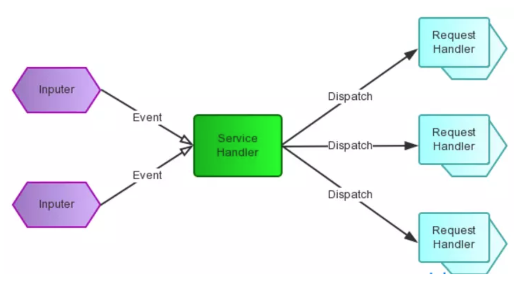
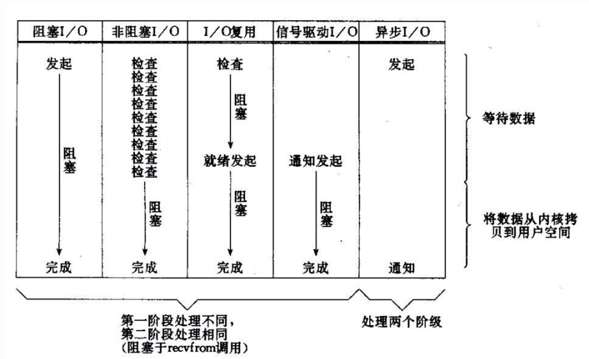
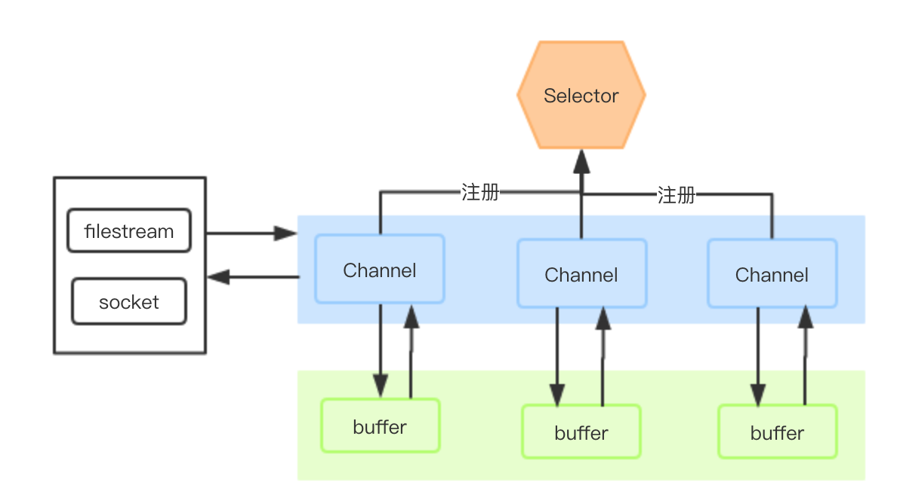

## Netty 
### 一. 简介

 Netty是由JBOSS提供的一个java开源框架。提供异步的、事件驱动的网络应用程序框架和工具，用以快速开发高性能、高可靠性的**网络服务器和客户端程序**。

### 二. 前瞻知识

#### 1. 概念解释

同步和异步关注的是**消息通信机制**。

- 同步：发出一个调用，在没有得到结果之前，这个调用一直在等待结果，直到获得结果后再返回。

  例：你去买书《冰与火》，老板去查是否有货，你一直等待老板的查询结果。

- 异步：发出一个调用后就直接返回了，被调用者通过某种机制通知调用者结果。

  例：你去买书《冰与火》，老板去查是否有货，你去干别的事，老板查到后电话通知你结果。

阻塞和非阻塞关注的是**程序在等待调用结果（消息，返回值）时的状态**。对于Java，线程是最小的执行单元。

- 阻塞：程序进行read()操作，从Socket读取数据，完全读取数据前，处理程序的当前线程一直被挂起。
- 非阻塞：read()操作，读取已有数据或无数据可读时，直接返回，然后在尝试读取。

```markdown
老张爱喝茶，废话不说，煮开水。
出场人物：老张，水壶两把（普通水壶，简称水壶；会响的水壶，简称响水壶）。
1 老张把水壶放到火上，立等水开。
	（同步阻塞）老张觉得自己有点傻
2 老张把水壶放到火上，去客厅看电视，时不时去厨房看看水开没有。
	（同步非阻塞）老张还是觉得自己有点傻，于是变高端了，买了把会响笛的那种水壶。水开之后，能大声发出嘀~~~~的噪音。
3 老张把响水壶放到火上，立等水开。
	（异步阻塞）老张觉得这样傻等意义不大
4 老张把响水壶放到火上，去客厅看电视，水壶响之前不再去看它了，响了再去拿壶。
	（异步非阻塞）老张觉得自己聪明了。
所谓同步异步，只是对于水壶而言。普通水壶，同步；响水壶，异步。虽然都能干活，但响水壶可以在自己完工之后，提示老张水开了。这是普通水壶所不能及的。
同步只能让调用者去轮询自己（情况2中），造成老张效率的低下。
所谓阻塞非阻塞，仅仅对于老张而言。立等的老张，阻塞；看电视的老张，非阻塞。情况1和情况3中老张就是阻塞的，媳妇喊他都不知道。虽然3中响水壶是异步的，可对于立等的老张没有太大的意义。所以一般异步是配合非阻塞使用的，这样才能发挥异步的效用。
```

#### 2. BIO

传统的IO，是Blocking IO，即阻塞I/O模型。一个连接（线程）在处理I/O时，系统是阻塞的，而CPU被释放出来，为了充分利用CPU，多采用多线程的方式进行处理，可以让每一个连接专注于自己的I/O并且编程模型简单，也不用过多考虑系统的过载、限流等问题。适用于**活动连接数不是特别高（小于单机1000）**的情况。

```java
/**
	服务端
**/
ExecutorService executorService = Executors.newFixedThreadPool(4);
ServerSocket serverSocket = new ServerSocket(8000);
while(flag) {
  Socket client = serverSocket.accept(); 	// 接收一个Client
  executorService.submit(new EchoServerHandler(client));	// 开始处理任务
}
/**
	客户端 Echo 请求处理类, 一个线程处理一个客户端
**/
public class EchoServerHandler implements Runnable {
  private Socket client; // 客户端，每一个客户端都需要启动一个任务(task)来执行。
	private boolean flag = true;	// 处理标识
  public EchoServerHandler(Socket client) {
		this.client = client;
	}
  @Override
	public void run() {
		while (this.flag) {
			String str = socket.read()....//读取数据
        if(str != null) {
          	......//处理数据
             socket.write()....//写数据
        } else {
          flag = false;
        }
	}
}
```

**不足之处**

1. 线程的创建和销毁成本很高，在Linux这样的操作系统中，线程本质上就是一个进程。创建和销毁都是重量级的系统函数。
2. 线程本身占用较大内存，像Java的线程栈，一般至少分配512K～1M的空间，如果系统中的线程数过千，恐怕整个JVM的内存都会被吃掉一半。
3. 线程的切换成本是很高的。操作系统发生线程切换的时候，需要保留线程的上下文，然后执行系统调用。如果线程数过高，可能执行线程切换的时间甚至会大于线程执行的时间，这时候带来的表现往往是系统load偏高、CPU sy使用率特别高（超过20%以上)，导致系统几乎陷入不可用的状态。
4.  容易造成锯齿状的系统负载。因为系统负载是用活动线程数或CPU核心数，一旦线程数量高但外部网络环境不是很稳定，就很容易造成大量请求的结果同时返回，激活大量阻塞线程从而使系统负载压力过大。

#### 3. NIO

**1）Reactor 模式**

Reactor模式是基于事件驱动的分发处理模型。



1）分而治之
 一个连接里完整的网络处理过程一般分为accept、read、decode、process、encode、send这几步。
 Reactor模式将每个步骤映射为一个Task，服务端线程执行的最小逻辑单元不再是一次完整的网络请求，而是Task，且采用非阻塞方式执行。

2）事件驱动
 每个Task对应特定网络事件。当Task准备就绪时，Reactor收到对应的网络事件通知，并将Task分发给绑定了对应网络事件的Handler执行。

参考：

- https://www.jianshu.com/p/da96ff9066a3

**2）NIO**

**传统的I/O模型**



对于NIO，socket主要的读、写、注册和接受函数，在等待就绪阶段都是非阻塞的，真正的I/O操作是同步阻塞的（消耗CPU但性能高）。另外，NIO是Reactor模式的一种实现，主要处理的事件有读就绪、写就绪、新连接接入，每个新事件都会注册到 Selector 上，Selector 选择就绪的事件，交由具体的事件处理器来处理。

注意：**select是阻塞的，无论是通过操作系统的通知（epoll）还是不停的轮询(select，poll)，这个函数是阻塞的。所以你可以放心大胆地在一个while(true)里面调用这个函数而不用担心CPU空转。**

**NIO 原理图**



- **Channel**

  所有的 IO 在NIO 中都从一个Channel 开始。Channel 有点像流。 数据可以从Channel读到Buffer中，也可以从Buffer写到Channel中。各种Channel（FileChannel、SocketChannel、ServerSocketChannel）处理不通的IO流。

- **Buffer**

  Buffer本质上是内存中的一块，Channel 将数据写入这块内存，之后从这块内存中读取数据。Buffer 的主要使用方式。

  主要属性：position、limit、capacity

  - capacity：缓冲区的容量，设置后不能修改，一旦buffer达到capacity后，需要清空才能重新写入数据。

  - limit

    - 写操作：limit == capacity，表示最大能写入的数据。
    - 读模式：limit  等于实际数据的大小，因为不一定完全写满 buffer。

  - position

    position 的初始值是 0，每往 Buffer 中写入一个值，position 就自动加 1，代表下一次的写入位置。读操作的时候也是类似的，每读一个值，position 就自动加 1。

    写操作切换读操作时（flip），position 都会归零。

- **Selector**

  Selector 是一个或多个 SelectableChannel 对象的多路复用器。Channel 注册到 Selector 上，并告知其关心的事件，Selector 轮询获取事件已经就绪的Channel（这个过程是阻塞的），当有一个或多个 Channel 就绪了，Selector 通过 SelectionKey 来对应 Channel 注册事件，并进行业务处理。
  
  **事件：**每次请求到达服务器，都是从connect开始，connect成功后，服务端开始准备accept，准备就绪，开始读数据，并处理，最后写回数据返
  
  1、connect：客户端连接服务端事件，对应值为SelectionKey.OP_CONNECT(8)
  2、accept：服务端接收客户端连接事件，对应值为SelectionKey.OP_ACCEPT(16)
  3、read：读事件，对应值为SelectionKey.OP_READ(1)
  4、write：写事件，对应值为SelectionKey.OP_WRITE(4)
  
  注意：可以使用一个线程来管理Selector，Selector 管理多个 Channel，减少线程切换性能损耗。

### 三. Netty

#### 1. EventLoopGroup


#### 2. Pipeline


#### 3. 序列化


### 八. 参考资料

- **NIO**

  - https://tech.meituan.com/2016/11/04/nio.html
- http://tutorials.jenkov.com/java-nio/index.html
  - http://ifeve.com/overview
- http://www.importnew.com/24794.html
- Netty
  - https://www.cnblogs.com/chenmo-xpw/p/3938284.html